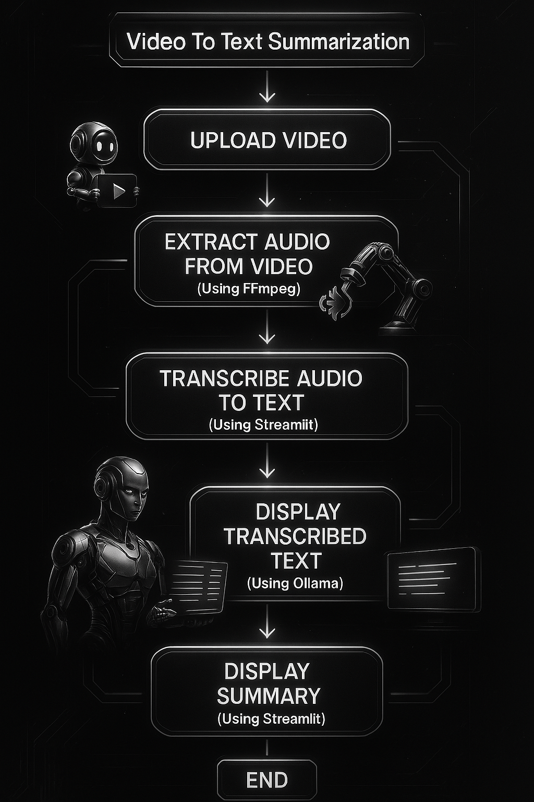

# 📄 Video To Text Summarization

Welcome to the documentation for your GitHub repository! This guide provides installation instructions and example code snippets for each of the key technologies used in your project:

- **FFmpeg**
- **Whisper**
- **Ollama**
- **Streamlit**
- **Ngrok**

---

## 🛠️ Technologies Used

- **FFmpeg** 🎥: A multimedia framework for extracting audio from video files.  
- **Whisper** 🎙️: An automatic speech recognition (ASR) system by OpenAI for transcribing audio.  
- **Ollama** 🤖: A language model for summarizing text.  
- **Streamlit** 🚀: A framework for building interactive web apps.  
- **Ngrok** 🌐: A tool to expose local servers to the internet.  

---

## 1. FFmpeg 🎥

### 📥 Installation

**On Ubuntu:**

```bash
sudo apt update
sudo apt install ffmpeg
```

**On macOS (using Homebrew):**

```bash
brew install ffmpeg
```

**On Windows:**

Download the executable from the [official FFmpeg website](https://ffmpeg.org/download.html).

### 🚀 Example Code

```python
import ffmpeg

# Extract audio from a video file
ffmpeg.input('input_video.mp4').output('output_audio.mp3').run()
print("Audio extracted successfully! 🎉")
```

---

## 2. Whisper 🎙️

### 📥 Installation

```bash
pip install openai-whisper
```

### 🚀 Example Code

```python
import whisper

# Load the Whisper model
model = whisper.load_model("base")

# Transcribe audio to text
result = model.transcribe("output_audio.mp3")

print("Transcription: 📝")
print(result["text"])
```

---

## 3. Ollama 🤖

### 📥 Installation

```bash
pip install langchain-ollama
```

### 🚀 Example Code

```python
from langchain_ollama import OllamaLLM

# Initialize Ollama
ollama_model = OllamaLLM(model="summarizer")

# Summarize text
summary = ollama_model.invoke("Summarize this text: Your long text goes here.")

print("Summary: 📄")
print(summary)
```

---

## 4. Streamlit 🚀

### 📥 Installation

```bash
pip install streamlit
```

### 🚀 Example Code

```python
import streamlit as st

# Create a simple Streamlit app
st.title("Hello, Streamlit! 👋")
st.write("This is a simple web app built with Streamlit.")
```

### ▶️ Run the app

```bash
streamlit run app.py
```

---

## 5. Ngrok 🌐

### 📥 Installation

```bash
pip install pyngrok
```

### 🚀 Example Code

```python
from pyngrok import ngrok

# Start an Ngrok tunnel
public_url = ngrok.connect(addr="8000", proto="http")
print(f"Your app is now live at: {public_url} 🌍")
```

---

## ↔️ Flow



---

## ╰┈➤ Next Steps

1. **Combine the Technologies**: Use FFmpeg, Whisper, Ollama, and Streamlit together to build a video-to-summary pipeline.  
2. **Deploy with Ngrok**: Share your app with others by exposing it using Ngrok.  
3. **Explore Further**: Customize the models, add new features, or integrate additional tools.  

---

## 🧭 Explanation of Flowchart

1. 🟢 **Start**: The process begins.  
2. 📤 **Upload Video**: Upload your video file.  
3. 🎵 **Extract Audio from Video**: Use **FFmpeg** to extract audio.  
4. 🎙️ **Transcribe Audio**: Use **Whisper** to transcribe the audio into text.  
5. 📝 **Display Transcribed Text**: Show transcribed text using **Streamlit**.  
6. 📄 **Summarize Text**: Use **Ollama** to summarize the transcribed text.  
7. 📋 **Display Summary**: Display the summary using **Streamlit**.  
8. 🏁 **End**: The process concludes.
